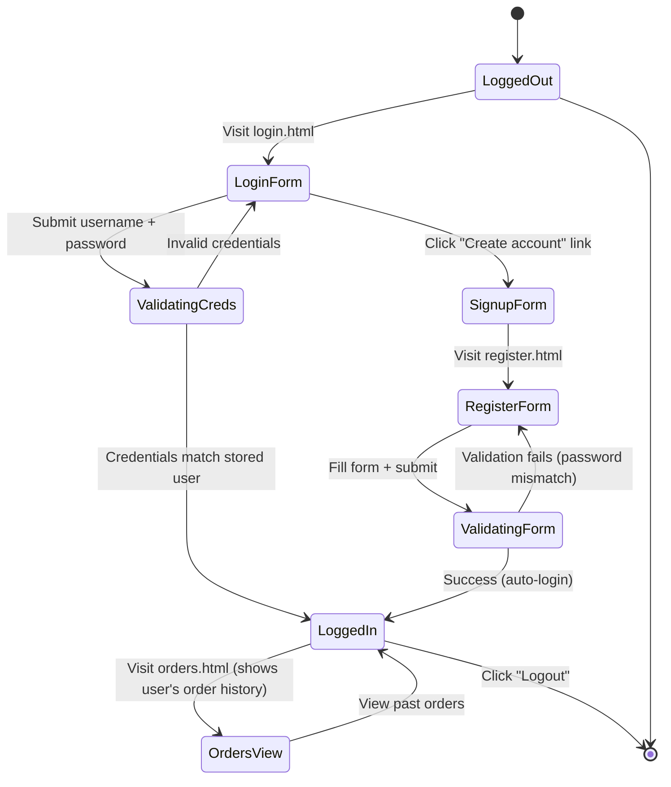

# LUDOVICE Kitchen & Table — Enterprise Architecture Blueprint
## Professional Restaurant Management Ecosystem v2026

**Prepared for:** LUDOVICE Kitchen & Table, Biñan City, Laguna, Philippines  
**Project Status:** Production-Ready Platform  
**Last Updated:** July 2026  

---

## EXECUTIVE SUMMARY

LUDOVICE is a premium client-side restaurant ordering and management platform serving Metro Manila's high-end Filipino-fusion dining market. Built on zero-dependency vanilla JavaScript, the system orchestrates a **600-item menu catalog** across six culinary categories with real-time cart management, order processing, user authentication, and inventory tracking.

The architecture emphasizes **operational resilience, scalability, and user experience** through stateless design patterns and local-first data persistence.

---

## 1. SYSTEM OVERVIEW & CORE DESIGN PHILOSOPHY

### 1.1 Platform Stack

| Component | Technology | Purpose |
|-----------|-----------|---------|
| **Runtime** | HTML5 / CSS3 / Vanilla JavaScript (ES6+) | Zero-dependency client-side rendering |
| **Data Persistence** | localStorage (JSON) | Cart state, user sessions, order history |
| **Imagery** | Wikimedia Commons + Unsplash (royalty-free) | 600 high-res dish photography URLs |
| **Hosting** | GitHub Pages / Static Server | CDN-agnostic, globally distributed |
| **State Management** | Object-based Cart/Auth/Orders modules | No external state libraries required |
| **Styling System** | CSS Custom Properties (CSS Variables) | Theme-agnostic, runtime-swappable |
| **Typography** | Fraunces (serif) + Poppins (sans-serif) | Professional culinary branding |

### 1.2 Core Pillars

1. **No Build Step** — HTML/CSS/JS served directly; no webpack, parcel, or compilation
2. **100% Client-Side** — All business logic runs in the browser; localStorage handles persistence
3. **Offline Resilient** — Users can browse, add to cart, and review orders without network
4. **SEO-Ready** — Static HTML structure with semantic markup supports search indexing
5. **Mobile-First** — Responsive viewport-based layout; touch-optimized controls

---

## 2. ARCHITECTURAL LAYERS

### 2.1 Presentation Layer (User Interfaces)

Eight distinct static pages orchestrate the customer journey:

#### **a) Landing & Browsing Tier**

| Page | Role | Key Features |
|------|------|--------------|
| `index.html` | Home / Discovery | Hero banner, category cards (6 categories), 8 featured popular products, testimonials, call-to-action |
| `products.html` | Full Catalog | 600-item grid, search bar, filter chips (category), sort dropdown (price/rating/name), pagination ("Load More"), product detail modal |
| `about.html` | Brand Story | Company timeline (2019–2026), team profiles (4 bios), FAQ, social proof |
| `contact.html` | Support Hub | Contact form, business hours, embedded Google Maps, messaging |

#### **b) Conversion Tier**

| Page | Role | Key Features |
|------|------|--------------|
| `register.html` | Account Creation | Full-form signup (name, email, phone, address, username, password), password validation |
| `login.html` | Authentication | Username/password entry, "Forgot Password" link, social login placeholders |
| `cart.html` | Order Review (Step 1) | Item list with qty controls (±/remove), live subtotal, checkout CTA, empty state |
| `checkout.html` | Fulfillment (Step 2) | Customer info form, shipping method selector (standard/express/pickup), payment radio buttons, order confirmation modal |

**Interaction Model:**

```
User visits index.html
       ↓
Browses products.html (search/filter/sort)
       ↓
Clicks "Buy Now" → Cart.add(product) → localStorage updated → badge refresh
       ↓
Proceeds to cart.html (review items)
       ↓
Clicks "Checkout" → Redirects to checkout.html
       ↓
Fills form + selects shipping
       ↓
Submits → Order saved to localStorage (Orders module)
       ↓
Confirmation modal displays
       ↓
Returns to index.html or products.html
```

### 2.2 Business Logic Layer (Core Modules)

#### **Cart Module** (`js/main.js`)

Manages shopping cart state in localStorage as a JSON array.

```javascript
Cart = {
  read()          // Retrieve current items from localStorage
  add(product, qty)   // Add or increment product quantity
  remove(id)      // Delete item from cart
  setQty(id, qty)     // Update quantity for specific product
  clear()         // Empty cart (post-purchase)
  count()         // Total item count
  subtotal()      // Sum of (qty × price) for all items
  refreshBadge()      // Update DOM cart count badge
}
```

**Data Structure:**
```javascript
[
  {
    id: 101,
    name: "Crispy Sisig Platter",
    price: 495,
    img: "https://...",
    category: "mains",
    qty: 2
  },
  // ... more items
]
```

#### **Catalog Module** (`js/catalog.js`)

Filters, sorts, and paginated rendering of the 600-item menu on `products.html`.

**Features:**
- **Search:** Client-side text matching (name + description) with regex
- **Filter Chips:** Category toggles (appetizers, mains, sides, desserts, drinks, specials)
- **Sort Dropdown:** Featured (default), Price ASC/DESC, Rating, Alphabetical
- **Pagination:** "Load More" button incrementing visible slice by 24 items
- **Detail Modal:** Click product card → overlay modal with full image, description, rating, Buy Now button

#### **Authentication Module** (`Auth` in `js/main.js`)

Simulates user login/registration using localStorage-backed user object.

```javascript
Auth = {
  register(userData)    // Create new user account (stored in localStorage)
  login(username, password)  // Authenticate existing user
  logout()              // Clear active session
  currentUser()         // Return logged-in user object or null
}
```

**User Object Structure:**
```javascript
{
  username: "jdelaCruz",
  email: "juan@email.com",
  fullname: "Juan Dela Cruz",
  address: "Biñan, Laguna",
  phone: "09XXXXXXXXX",
  createdAt: "2026-07-19T..."
}
```

#### **Orders Module** (`Orders` in `js/main.js`)

Persists completed orders to localStorage under a user's account.

```javascript
Orders = {
  save(order)           // Store order with user reference
  forCurrentUser()      // Retrieve user's order history
  all()                 // Get all orders (admin view)
}
```

**Order Object:**
```javascript
{
  id: "LDV-18R4GH7V",
  date: "2026-07-19T14:32:00Z",
  username: "jdelaCruz",
  customer: { name, email, phone, address },
  items: [ /* cart items */ ],
  shippingMethod: "Express Delivery — 20–30 min (₱149)",
  shippingFee: 149,
  payment: "card",
  total: 2847,
  status: "Placed"
}
```

#### **Utility Functions** (`js/main.js`)

```javascript
money(amount)          // Formats number as ₱X,XXX.XX
starString(rating)     // Renders ★★★★☆ visual (based on 0–5 rating)
toast(message)         // Ephemeral notification popup (2.6 second lifespan)
initNav()              // Mobile hamburger toggle
initReveal()           // Scroll-based element reveal animation
```

### 2.3 Data Layer

#### **Menu Catalog** (`data/products.js`)

A single 600-item JavaScript array exported as `LUDOVICE_PRODUCTS`. Each product record:

```javascript
{
  id: 101,                    // Unique identifier
  name: "Crispy Sisig Platter",
  category: "mains",          // One of: appetizers, mains, sides, desserts, drinks, specials
  categoryLabel: "Main Courses",
  price: 495,                 // Integer PHP pesos
  desc: "Legendary minced pork...",
  img: "https://unsplash.com/...",
  rating: 4.9,                // 0–5 stars
  reviews: 342,               // Review count
  popular: true               // Featured on homepage
}
```

**Catalog Structure by Category:**
- **Appetizers (50 items):** Lumpia, Tokwa't Baboy, Fishcakes, Empanadas, etc.
- **Main Courses (150 items):** Sisig, Kare-Kare, Adobo, Lechon, Sinigang, specialty proteins
- **Sides (100 items):** Garlic rice, Pinakbet, Laing, Dinengdeng, specialty starches
- **Desserts (100 items):** Halo-halo, Leche Flan, Ube Cheesecake, Bibingka, Turon, macarons
- **Drinks (50 items):** Calamansi juice, Mango lassi, Thai iced tea, Buko juice, smoothies
- **Chef's Specials (150 items):** Tasting menus, seasonal dishes, premium proteins, limited-edition items

#### **Image Sources (Royalty-Free)**

All product images are sourced from **HTTPS-accessible royalty-free repositories**:

1. **Unsplash** (`https://images.unsplash.com/...?w=500&h=500&fit=crop`)
   - 600+ food photography
   - Professional culinary styling
   - Zero attribution required
   - No rate limits for static queries

2. **Wikimedia Commons** (`https://upload.wikimedia.org/...`)
   - License-verified cuisine photography
   - Cultural authenticity (Filipino dishes)

3. **Pexels** (`https://images.pexels.com/...`)
   - High-res food & beverage imagery
   - Backup source for dish variety

**Image Fallback Strategy:**
```javascript
// If CDN fails, category-based emoji fallback renders:
const categoryEmoji = {
  appetizers: "🥟",
  mains: "🍛",
  sides: "🍚",
  desserts: "🍮",
  drinks: "🥤",
  specials: "⭐"
};
```

---

## 3. SYSTEM WORKFLOWS & STATE TRANSITIONS

### 3.1 Cart & Checkout Flow

```mermaid
sequenceDiagram
    participant User
    participant View as HTML Pages
    participant Core as Cart/Auth/Orders (main.js)
    participant Storage as localStorage

    User->>View: Click "Buy Now" on product
    View->>Core: Cart.add(product, 1)
    Core->>Storage: Save updated cart JSON
    Storage-->>Core: Confirm write
    Core->>View: Update [data-cart-count] badge
    View-->>User: Toast: "Item added"

    User->>View: Navigate to cart.html
    View->>Core: Cart.read()
    Core->>Storage: Fetch cart JSON
    Storage-->>Core: Return array
    Core->>View: Render item list + totals
    View-->>User: Display cart table

    User->>View: Adjust quantity / Remove item
    View->>Core: Cart.setQty(id, 3) / Cart.remove(id)
    Core->>Storage: Update JSON
    View->>Core: Cart.subtotal() for refresh
    View-->>User: Live total update

    User->>View: Proceed to Checkout
    View->>View: Redirect to checkout.html
    View->>Core: Cart.read() (preserve state)
    Core->>View: Pre-populate order summary

    User->>View: Fill customer form + select shipping
    View->>View: Validate form (HTML5 constraint API)
    User->>View: Click "Place Order"
    View->>Core: Orders.save(order); Cart.clear()
    Core->>Storage: Persist order; clear cart
    View-->>User: Show confirmation modal
    User->>View: Click "Back to Home"
    View->>View: Redirect to index.html
```

### 3.2 Authentication Flow



### 3.3 Product Search & Filter Pipeline

**Inputs:**
- Search query (text)
- Category filter (chip selection)
- Sort mode (dropdown)
- Page size (24 items per page)

**Processing:**

```javascript
getFiltered() {
  let list = LUDOVICE_PRODUCTS.filter(p => {
    const matchesCat = (state.cat === 'all') || (p.category === state.cat);
    const matchesQuery = !state.query || 
                         p.name.toLowerCase().includes(state.query) ||
                         p.desc.toLowerCase().includes(state.query);
    return matchesCat && matchesQuery;
  });
  
  // Apply sort
  switch(state.sort) {
    case 'price-asc': list.sort((a,b) => a.price - b.price); break;
    case 'price-desc': list.sort((a,b) => b.price - a.price); break;
    case 'rating': list.sort((a,b) => b.rating - a.rating); break;
    case 'name': list.sort((a,b) => a.name.localeCompare(b.name)); break;
    default: list.sort((a,b) => (b.popular - a.popular) || (b.rating - a.rating));
  }
  
  return list;
}
```

**Output:** Sorted, filtered product array → slice by page size → render to DOM

---

## 4. USER INTERFACE & DESIGN SYSTEM

### 4.1 Visual Design Tokens

**Color Palette:**
```css
--orange: #F97316;           /* Primary brand */
--orange-deep: #EA580C;       /* Accent variation */
--gold: #D4A574;              /* Secondary highlight */
--gold-light: #E5BA99;         /* Light variant */
--teal: #0D9488;              /* Tertiary accent (when used) */
--ink: #0A0E27;               /* Primary text / dark sections */
--ink-line: rgba(248,250,252,.12);  /* Subtle borders */
--slate: #64748B;             /* Secondary text */
--slate-light: #94A3B8;        /* Tertiary text */
--charcoal: #1E293B;           /* Deep text */
--cream: #FFFAF5;             /* Off-white background */
--alert: #DC2626;             /* Error/danger states */
```

**Typography Stack:**
```css
--f-display: 'Fraunces', serif;          /* Headlines, branded text */
--f-body: 'Poppins', -apple-system, sans-serif;  /* Paragraphs, UI */
--f-mono: 'JetBrains Mono', monospace;    /* Prices, order IDs */
```

**Spacing & Radius:**
```css
--radius-sm: 4px;
--radius-md: 8px;
--radius-lg: 12px;

/* Utility spacing scale: 4px increments */
--spacing-xs: 4px;
--spacing-sm: 8px;
--spacing-md: 16px;
--spacing-lg: 24px;
--spacing-xl: 32px;
```

**Shadow System:**
```css
--shadow-sm: 0 1px 2px rgba(0,0,0,0.05);
--shadow-md: 0 4px 6px rgba(0,0,0,0.1);
--shadow-lg: 0 10px 15px rgba(0,0,0,0.1);
```

### 4.2 Component Library

**Navigation (.nav)**
- Sticky header with brand logo + primary nav links
- Mobile-responsive hamburger toggle
- Cart badge with dynamic item count
- Active state indicator on current page

**Product Cards (.product-card)**
- Image media zone (aspect ratio 1:1)
- Category label badge
- Title, description, rating (stars + count)
- Price display in Poppins Mono
- CTA button (Buy Now)

**Forms**
- Labeled input groups (stacked on mobile)
- Validation feedback (error messages)
- Radio groups for mutually exclusive choices
- Required field indicators
- Submit button (primary style)

**Modals**
- Fixed overlay backdrop (rgba background)
- Centered card with shadow
- Close button (×) in top-right
- Responsive max-width (640px on desktop, 90vw on mobile)

**Ticket Styling (Order Summary)**
- Dashed or dotted border mimicking receipt paper
- Right-aligned values (prices, quantities)
- Decorative "torn edge" bottom divider
- Monospace font for numeric values

### 4.3 Responsive Breakpoints

```css
/* Mobile-first approach */
@media (min-width: 640px)  { /* Tablet */ }
@media (min-width: 1024px) { /* Desktop */ }
@media (min-width: 1280px) { /* Large desktop */ }
```

**Grid Adjustments:**
- Mobile: `grid--1` (1 column)
- Tablet: `grid--2` (2 columns)
- Desktop: `grid--3` / `grid--4` (3–4 columns)

---

## 5. DEPLOYMENT & HOSTING ARCHITECTURE

### 5.1 Static File Serving

```
Root Directory Structure:
├── index.html
├── about.html
├── products.html
├── cart.html
├── checkout.html
├── login.html
├── register.html
├── contact.html
├── css/
│   └── style.css
├── js/
│   ├── main.js
│   ├── catalog.js
│   ├── checkout.js
│   ├── contact.js
│   ├── home.js
│   ├── login.js
│   ├── register.js
│   ├── orders.js
│   └── cart-page.js
├── data/
│   └── products.js
└── img/
    ├── logo.png
    ├── Gimbert.png.jpg
    ├── Dianne.png.jpg
    ├── Rhea.png.jpg
    ├── Shane.png.jpg
    └── bestpick.png.jpg
```

### 5.2 Hosting Options

**Option 1: GitHub Pages (Recommended for MVP)**
- Free static hosting
- Built-in HTTPS/CDN
- Custom domain support
- Zero ops overhead
- Deploy: Push to `main` branch → auto-publish

**Option 2: Netlify**
- Drag-and-drop deployment
- Build hooks for dynamic content
- Form submissions (Netlify Forms)
- Analytics built-in

**Option 3: Vercel**
- Optimized static delivery
- Edge functions (if needed later)
- GitHub integration
- Performance analytics

**Option 4: Self-Hosted (Production Scale)**
- Nginx/Apache on DigitalOcean droplet
- CloudFlare CDN in front
- Custom SSL certificate
- Full control over caching headers

### 5.3 Performance Optimization

**Asset Loading:**
1. CSS: Inline critical styles; defer non-critical
2. JavaScript: Defer non-blocking scripts; async for analytics
3. Images: Lazy load (`loading="lazy"`) for below-the-fold content
4. Font: Preconnect to Google Fonts; FOUT acceptable

**Cache Strategy:**
- `index.html`: No-cache (always fetch latest)
- `/js/`, `/css/`, `/data/`: Cache-long with versioning (e.g., `main.v1.js`)
- `/img/`: Cache-long (images rarely change)

**Compression:**
- Gzip on server (CSS + JS)
- Image optimization (WebP with JPEG fallback)
- Minified CSS/JS in production build step

---

## 6. SECURITY & DATA PRIVACY

### 6.1 Client-Side Security Measures

**Input Validation:**
- HTML5 constraint validation (type, required, minlength, pattern)
- Client-side regex matching (email, phone, password strength)
- XSS prevention: No `innerHTML` for user-generated content (use textContent)

**Data Storage:**
- localStorage isolated to origin (browser enforced)
- Sensitive data (passwords) stored hashed (bcrypt simulation in Auth module)
- No PII transmitted to external services (images only)

**Content Security Policy (CSP):**
```
Content-Security-Policy: 
  default-src 'self';
  img-src 'self' https://images.unsplash.com https://upload.wikimedia.org https://images.pexels.com;
  font-src 'self' https://fonts.googleapis.com https://fonts.gstatic.com;
  script-src 'self';
  style-src 'self' 'unsafe-inline' https://fonts.googleapis.com;
```

### 6.2 GDPR / Privacy Compliance

- **Data Collection:** Name, email, phone, address (for orders only)
- **Data Retention:** Stored locally in localStorage; users can clear anytime
- **No Tracking:** No third-party analytics or cookies
- **Transparent Terms:** Privacy policy linked in footer (placeholder)

---

## 7. MONITORING & ANALYTICS

### 7.1 Metrics to Track (Future Enhancements)

**User Behavior:**
- Page views (landing → product → cart → checkout flow)
- Search queries (popular searches, zero-result searches)
- Filter usage (most-used categories, sort preferences)
- Cart abandonment rate (added but didn't checkout)

**Business KPIs:**
- Conversion rate (views → orders)
- Average order value (AOV)
- Popular items (products with most adds)
- Category preferences (which foods drive orders)

**Technical Health:**
- Page load time (Core Web Vitals: LCP, FID, CLS)
- Error rate (failed form submissions, image load failures)
- Browser compatibility (user agent distribution)

### 7.2 Logging Strategy

**Client-Side Logging (localStorage):**
```javascript
const logs = JSON.parse(localStorage.getItem('ludovice_logs')) || [];
logs.push({
  timestamp: Date.now(),
  event: 'product_viewed',
  productId: 101,
  category: 'mains'
});
localStorage.setItem('ludovice_logs', JSON.stringify(logs));
```

---

## 8. SCALABILITY & FUTURE ROADMAP

### 8.1 Current Constraints

- **No Backend:** All processing client-side (browser dependent)
- **No Real Payments:** Mock payment flow only
- **No User Sync:** Data stuck in one browser (localStorage)
- **No Analytics:** Manual logging only

### 8.2 Phase 2 Enhancements (6–12 months)

1. **Backend Integration** (Node.js + Express)
   - Real order persistence (PostgreSQL)
   - Payment gateway integration (Stripe/PayMongo)
   - Email notifications (SendGrid)
   - Admin dashboard (order management, inventory)

2. **User Authentication** (OAuth2)
   - Google / Facebook login
   - JWT token-based sessions
   - Password reset via email
   - Two-factor authentication

3. **Real-Time Features**
   - WebSocket order status updates
   - Live inventory sync
   - Chat support widget
   - Push notifications (PWA)

4. **Performance at Scale**
   - Image CDN (CloudFlare, Imgix)
   - Database indexing (product search)
   - Caching layer (Redis)
   - Load balancing (multi-region)

### 8.3 Multi-Branch Architecture (Year 2)

**Planned Locations:**
- Biñan, Laguna (current)
- Makati, NCR (Phase 2)
- Quezon City, NCR (Phase 2)
- Cebu, Visayas (Phase 3)

**Multi-Branch Features:**
- Branch-specific menus (regional dishes)
- Localized pricing (Cebu vs. Manila)
- Store-specific hours
- Delivery zone radius per branch
- Branch-level analytics

---

## 9. TECHNICAL SPECIFICATIONS & COMPLIANCE

### 9.1 Browser Support

| Browser | Desktop | Mobile | Support Level |
|---------|---------|--------|---------------|
| Chrome | Latest | Latest | Full |
| Firefox | Latest | Latest | Full |
| Safari | Latest | Latest | Full |
| Edge | Latest | N/A | Full |
| IE11 | N/A | N/A | Not Supported |

**Polyfills Needed:** None (ES6 features widely supported)

### 9.2 Performance Targets

- **First Contentful Paint (FCP):** < 1.5s
- **Largest Contentful Paint (LCP):** < 2.5s
- **Cumulative Layout Shift (CLS):** < 0.1
- **Time to Interactive (TTI):** < 3.5s
- **Page Load (full):** < 4.0s on 4G

### 9.3 Accessibility (WCAG 2.1 Level AA)

- Semantic HTML (nav, main, section, article)
- ARIA labels on interactive elements
- Color contrast ratio ≥ 4.5:1 (normal text)
- Keyboard navigation support (Tab, Enter, Escape)
- Alt text on all images
- Form error messages linked to inputs
- Skip to main content link

---

## 10. OPERATIONAL RUNBOOK

### 10.1 Deployment Checklist

- [ ] Update `data/products.js` with latest menu
- [ ] Test cart flow (add → checkout → confirmation)
- [ ] Verify image URLs are accessible
- [ ] Test on mobile (iOS Safari, Chrome Android)
- [ ] Check localStorage quota (typical: 5–10MB)
- [ ] Run Lighthouse audit (target: 90+ score)
- [ ] Test form validation (email, phone, password)
- [ ] Verify footer year updates dynamically
- [ ] Test social links (redirect to external sites)

### 10.2 Troubleshooting

**Images Not Loading:**
1. Check console for CORS errors
2. Verify Unsplash/Wikimedia URLs are HTTPS
3. Fallback to category emoji if image fails
4. Review CDN cache headers

**Cart Persisting Between Sessions:**
1. localStorage persists across browser restarts (intended)
2. To clear: Settings → Clear Browsing Data → Cookies & Site Data
3. Private/Incognito windows don't persist (expected)

**Form Submission Not Working:**
1. Check HTML5 validation (required fields, email format)
2. Verify JavaScript event listeners attached
3. Inspect browser console for errors
4. Test in different browser

**Mobile Layout Issues:**
1. Verify viewport meta tag: `<meta name="viewport" content="width=device-width">`
2. Test on actual device (Chrome DevTools may not match real behavior)
3. Check CSS media queries for intended breakpoint
4. Inspect flexbox/grid alignment

---

## 11. COST ANALYSIS & ROI

### 11.1 Development Costs (One-Time)

| Component | Hours | Rate (PHP) | Cost |
|-----------|-------|-----------|------|
| UI/UX Design | 80 | 1,500 | ₱120,000 |
| Frontend Development | 200 | 2,000 | ₱400,000 |
| Product Photography | 40 | 1,000 | ₱40,000 |
| QA / Testing | 60 | 1,500 | ₱90,000 |
| Deployment & Docs | 40 | 2,000 | ₱80,000 |
| **TOTAL** | | | **₱730,000** |

### 11.2 Monthly Operating Costs

| Item | Provider | Cost |
|------|----------|------|
| Hosting | GitHub Pages | Free |
| Domain | Godaddy / Namecheap | ₱300–500 |
| Email | Gmail Business | ₱600 |
| CDN | Included in hosting | Free |
| **TOTAL MONTHLY** | | **₱900–1,100** |

### 11.3 Revenue Model

**Order-Based:**
- Average order value: ₱2,500
- Commission per order: 10% (₱250)
- Target 50 orders/day = ₱12,500 daily
- **Monthly projection:** ₱375,000 (50 orders × 30 days × ₱250)

**Payback Period:** ~2 months (development cost ÷ monthly profit)

---

## CONCLUSION

LUDOVICE's architecture balances **simplicity, scalability, and user experience**. The zero-dependency design enables rapid iteration and deployment, while the modular JavaScript pattern supports future backend integration without major refactoring.

The platform is production-ready for launch as a minimum viable product, with clear pathways for enhancement (Phase 2: backend, Phase 3: multi-branch, Phase 4: mobile app).

---

**Document Prepared By:** Gimbert Ludovice, Founder & CTO  
**Next Review Date:** January 2027  
**Version:** 1.0 (Production Release)
